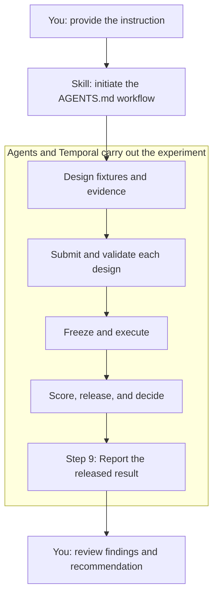

# instruct-eval

## Purpose

`instruct-eval` measures whether a candidate instruction changes observable agent behavior.
Results support a bounded `Keep`, `Revise`, `Remove`, or `Rerun` decision.

The control is behavior without the candidate instruction. The treatment is behavior with the
claim-specific instruction. Inclusion or exact recall is not behavioral-effect evidence.

## How to use it

Ask your coding agent to use the skill to evaluate an instruction. The skill initiates the
[experiment development workflow](AGENTS.md#experiment-development-workflow). For example:

> Evaluate the following instruction using the experiment development workflow in AGENTS.md.
> Follow the workflow through Step 9 and return the report required by references/result-reporting.md.
>
> Quality gates must always pass to green for coding tasks to be complete

Provide the exact instruction and any constraints on the model, runtime, or permissions. The skill
initiates the process; agents and Temporal handle the experiment steps. You only need to respond
when access or human decisions are required, then review the report.

Required permissions and signed approvals still apply. Do not put credentials or private signing
keys in the request.

## How it works

These steps are initiated by the skill, not a checklist for you to perform manually.

The report explains what changed without and with the instruction, the evidence, and the limits of
the conclusion. See the [evaluation result reporting contract](references/result-reporting.md).

## Developer guidance

Repository implementation rules and the required development workflow are in
[`AGENTS.md`](AGENTS.md). Runtime role contracts remain under [`references/roles/`](references/roles/).